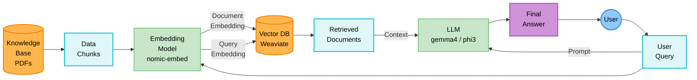

# PocketRAG — Local RAG for PDF Documents

> **Run AI on your own computer. No cloud. No API keys. No data leaves your machine.**

**PocketRAG** is a fully offline, self-hosted **Retrieval-Augmented Generation (RAG)** application that lets you chat with any PDF using local AI models. Built with **Ollama**, **Weaviate**, and **Next.js** — it runs entirely on your laptop, even without internet.

**Perfect for:** private documents, sensitive data, offline environments, air-gapped systems, or anyone who wants a free, local alternative to ChatGPT PDF tools.

---

## Key Features

- 🔒 **100% Offline & Private** — No data sent to any server. Everything runs locally.
- 🤖 **Local LLM** — Uses small language models (Gemma 4, Phi-3 Mini) via Ollama. No GPU needed.
- 🔍 **Hybrid Search** — Combines dense vector (semantic) search + BM25 keyword search for high-precision retrieval.
- 📄 **PDF Document Q&A** — Upload any text-based PDF and ask questions in plain English.
- 🗄️ **Local Vector Database** — Weaviate runs in Docker on your machine. No cloud vector DB needed.
- ⚡ **Grounded Answers** — The model only answers from your document. No hallucination from external knowledge.
- 🧩 **Switchable Models** — Toggle between Gemma 4 (capable) and Phi-3 Mini (faster) in the UI.
- 🛠️ **Developer-Friendly** — Built-in debug mode writes chunk logs and Q&A traces to local files.

---

## What is RAG? (Simple Explanation)

**RAG = Retrieval-Augmented Generation**

Imagine you give a very smart assistant a book to read. Instead of memorizing the whole book, the assistant bookmarks the most relevant pages when you ask a question, then answers using only those pages.

That's exactly what this app does with your PDF:

1. **Reads your PDF** and breaks it into small searchable pieces (called "chunks")
2. **Stores those chunks** in a local vector database (Weaviate)
3. **When you ask a question**, it runs hybrid search to find the most relevant chunks
4. **Feeds those chunks** to a local LLM (via Ollama) to generate a human-readable answer

The AI never guesses — it only answers from your document. This technique is called **Retrieval-Augmented Generation (RAG)**.

---


## What Tools Are Used (and Why)

| Tool | What it does | Why we use it |
|---|---|---|
| **Ollama** | Runs AI models locally on your computer | So no data ever leaves your machine |
| **Gemma 4 / Phi-3 Mini** | The LLM that reads chunks and writes answers | Small, fast models that run without a GPU |
| **nomic-embed-text** | Converts text into numbers (vectors) for smart search | Best open-source embedding model for retrieval |
| **Weaviate** | Local vector database that stores and searches chunks | Supports Hybrid Search (keyword + semantic) out of the box |
| **Docker** | Runs Weaviate as a container | Easy, no-install way to run Weaviate locally |
| **pdfjs-dist** | Extracts text from PDF files page by page | Mozilla's official PDF library — works with Node.js 24, no native dependencies |
| **Next.js** | The web framework for the chat UI | React-based, runs locally in your browser |

---

## How It Works (Under the Hood)

Here is the complete architecture of the RAG pipeline, showing both the ingestion of your documents and how your queries are answered:



### Step 1 — PDF Upload & Indexing
```
Your PDF
  → pdfjs-dist extracts text from each page (text-based PDFs only)
  → Split into ~350 character chunks (with 50 char overlap)
  → Each chunk is labelled with its page number
  → nomic-embed-text converts each chunk into a vector (list of numbers)
  → Text + vector stored together in Weaviate
```

### Step 2 — Asking a Question (Hybrid Search)
```
Your Question
  → Weaviate runs TWO searches simultaneously:
      1. Dense (Semantic) Search — finds chunks with similar meaning
      2. BM25 Keyword Search     — finds chunks with exact word matches
  → Both results are blended 50/50 (alpha = 0.5)
  → Top 5 most relevant chunks are returned
```

> **Why Hybrid Search?** Pure AI search often misses exact names, IDs, and numbers. BM25 catches those. Together, they give the best of both worlds.

### Step 3 — Answer Generation
```
Top 5 Chunks + Your Question
  → Sent to Gemma 4 (or Phi-3 Mini) via Ollama
  → Model is instructed: "Answer ONLY using the context below"
  → Final human-readable answer is shown in the chat
```

---

## Prerequisites — Install These First

> [!NOTE]
> PocketRAG works on **macOS, Windows, and Linux**. All tools below are cross-platform.

### 1. Node.js (v24.15.0)
Download from: https://nodejs.org/

To verify: open your terminal and run:
```bash
node --version
# Should print: v24.15.0
```

> This project was built and tested on **Node.js v24.15.0**. Use this version to avoid compatibility issues.

### 2. Docker Desktop
Docker lets you run Weaviate without installing it directly.

Download from: https://www.docker.com/products/docker-desktop/

After installing, **open Docker Desktop** and make sure it's running (you'll see the Docker whale icon in your taskbar/menu bar).

### 3. Ollama — Run AI Models Locally

**Ollama is the most important piece.** It lets you run AI models (like Gemma and Phi) entirely on your own computer, for free, with no API keys.

**Download and install from:** https://ollama.com/download

After installing, Ollama runs silently in the background. To verify it's working, open your terminal and run:
```bash
ollama --version
# Should print something like: ollama version 0.x.x
```

---

## Setup (Step by Step)

### Step 1 — Start Weaviate (the database)

Open your terminal and run this Docker command:

```bash
docker run -d \
  -p 8080:8080 \
  -p 50051:50051 \
  cr.weaviate.io/semitechnologies/weaviate:1.27.0
```

**To verify it's running:** open http://localhost:8080/v1/meta in your browser. You should see a JSON response.

> You only need to run this once. Next time, use `docker start <container-id>` or restart from Docker Desktop.

### Step 2 — Download the AI Models via Ollama

Open your terminal and run these commands **one at a time**:

```bash
# This is the embedding model — converts text into searchable vectors
# Size: ~274 MB
ollama pull nomic-embed-text
```

```bash
# This is the main LLM — reads your chunks and writes answers
# Size: ~3.3 GB (takes a few minutes to download)
ollama pull gemma4
```

```bash
# This is a smaller, faster alternative LLM (optional but recommended)
# Size: ~2.2 GB
ollama pull phi3:mini
```

> **These only need to be downloaded once.** After that, they live on your machine permanently.

### Step 3 — Clone and Install the App

```bash
# Install dependencies
npm install --legacy-peer-deps
```

> The `--legacy-peer-deps` flag is needed because some LangChain packages have minor version conflicts. This is safe and required.

### Step 4 — Run the App

```bash
npm run dev
```

Open **http://localhost:3000** in your browser. You should see the PDF Assistant chat interface.

---

## Usage

1. **Select a PDF** — Click "Select PDF" in the top bar and choose any PDF file from your computer.
2. **Upload & Index** — Click **Upload**. Wait for the status to change to "PDF Indexed ✅". (This may take 30–60 seconds for large PDFs.)
3. **Choose a Model** — Use the dropdown to switch between **Gemma 4** (more capable) and **Phi-3 Mini** (faster).
4. **Ask Questions** — Type your question and press **Enter** or click the send button.
5. **Clear & Reload** — Click **Clear DB** to remove the current PDF and upload a new one.

---

## Limitations

> [!IMPORTANT]
> **Only text-based PDFs are supported.**

This app extracts text directly from the PDF file. It does **not** support:

- ❌ **Scanned PDFs** — PDFs that are photos/images of documents (no selectable text layer)
- ❌ **Image-only PDFs** — PDFs where content is embedded as pictures
- ❌ **Handwritten documents** — even if scanned
- ❌ **Password-protected PDFs**
- ❌ **OCR (Optical Character Recognition)** — not built in

**How to check if your PDF is supported:** Open it in any viewer and try to highlight text with your cursor. If you can select individual words, it will work. If the cursor selects the whole page like an image, it won't.

If you upload an unsupported PDF, the app will show a clear error message in the chat.

---

## Troubleshooting

| Problem | Fix |
|---|---|
| Status shows "No PDF uploaded ❌" after refresh even though I uploaded | Make sure the Weaviate Docker container is still running |
| App is slow to respond | The LLM is running on your CPU. Phi-3 Mini is faster if you need quicker responses |
| `ollama pull` fails | Make sure Ollama is installed and running (`ollama serve` in terminal) |
| Docker command fails | Make sure Docker Desktop is open and running |
| `npm install` errors | Try `npm install --legacy-peer-deps` — the flag is required |

---

## Local Debugging

For development, the app has a built-in debug mode controlled by `lib/settings.ts`:

```ts
// lib/settings.ts
const settings = {
  LOCAL_DEBUGGING: true,  // set to false to disable
};
```

When `LOCAL_DEBUGGING` is `true`, two files are automatically written to the `_local_debug/` folder:

| File | Written when | Contents |
|---|---|---|
| `debug_uploaded_file_chunks.txt` | PDF is uploaded | Total chunk count + full text of every chunk |
| `debug_qna.txt` | Question is asked | Timestamp, question, retrieved context, LLM answer |

**Use these to diagnose:**
- Is the PDF being parsed correctly? (`debug_uploaded_file_chunks.txt`)
- Is Weaviate retrieving the right context? (`debug_qna.txt`)
- Is the LLM answering from context or hallucinating?

> [!NOTE]
> The `_local_debug/` folder is git-ignored — debug files are never pushed to GitHub.

---

## Project Structure

```
doc-search-app/
├── app/
│   ├── api/
│   │   ├── ask/route.ts       # POST /api/ask — runs hybrid search + LLM
│   │   ├── delete/route.ts    # POST /api/delete — wipes Weaviate collection
│   │   ├── status/route.ts    # GET /api/status — checks if PDF is indexed
│   │   └── upload/route.ts    # POST /api/upload — ingests PDF into Weaviate
│   ├── page.tsx               # Chat UI
│   └── layout.tsx             # Root layout
├── lib/
│   ├── rag.ts                 # Core RAG logic (loadPDF, askQuestion, deletePDFData)
│   └── settings.ts            # App-wide settings (LOCAL_DEBUGGING toggle)
├── _local_debug/              # Debug output — git-ignored, local use only
│   ├── debug_uploaded_file_chunks.txt
│   └── debug_qna.txt
└── uploads/                   # Temporary storage for uploaded PDFs
```
## UI

